# HELECAR-D Dataset Analysis

Standalone descriptive analysis of the analysed HELECAR-D trips used in this repository.
Numbers are taken from the existing local data audit under `outputs/data_audit/` and from the analysed CSV files under `HELECAR-D/data/Analysed/`.

Figures for this report live in [`figures/`](figures/) (PNG, 300 dpi).

This document does **not** change the experiment protocol, models, or paper results.

---

## 1. Source and scope

| Item | Value |
|---|---|
| Dataset | HELECAR-D |
| Paper | NaitMalek, Y., Najib, M., Bakhouya, M., Gaber, J., 2023. *Data in Brief* 48, 109080 |
| DOI (article) | https://doi.org/10.1016/j.dib.2023.109080 |
| DOI (data) | https://doi.org/10.5281/zenodo.7217707 |
| License | CC-BY-4.0 |
| Vehicle | Renault Twizy |
| Region | Rabat–Salé–Kénitra (Morocco) |
| Collection period (analysed files) | March–July 2021 |
| Files used here | **17 analysed** trip CSVs (not raw CAN dumps) |

Local layout:

```
HELECAR-D/data/Analysed/T1/*.csv   (4 trips)
HELECAR-D/data/Analysed/T2/*.csv   (3 trips)
HELECAR-D/data/Analysed/T3/*.csv  (10 trips)
```

Raw files also exist under `HELECAR-D/data/raw/`, but the audit and experiments use the **Analysed** split only.

---

## 2. What each trip file contains

Each analysed CSV has the original publisher columns plus a canonicalized copy used by the code. Original fields include:

| Field | Role |
|---|---|
| Date, Time | calendar timestamp |
| Soc | battery State of Charge (%) |
| Speed | CAN / vehicle speed |
| Mode | driving mode (N / D / R observed) |
| LAT, LON, ALT | GPS position and altitude |
| GpsSpeed | GPS-derived speed |
| Temperature, Humidity, Weather | ambient conditions |
| WindSpeedAv | wind-speed covariate (no direction) |
| Traffic | ordinal traffic level |
| SpeedLimit | posted speed limit |

**Important for energy modelling:** there is **no instantaneous battery-power column**. Battery information for energy is available only through SoC.

Across the 17 analysed trips there are **55,645** timestamp rows. Drive-mode counts in the audit: **D = 45,401**, **N = 10,130**, **R = 114**.

Example GPS tracks (one clean trip per trajectory; invalid coordinates filtered):

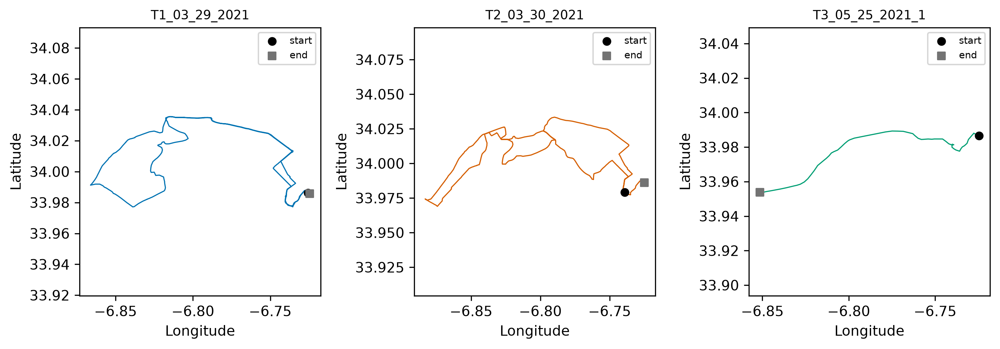

---

## 3. Trip inventory

### 3.1 Counts by trajectory

| Trajectory | Description (publisher) | Trips | Share |
|---|---|---:|---:|
| T1 | urban + ring | 4 | 23.5% |
| T2 | urban | 3 | 17.6% |
| T3 | ring / higher-speed | 10 | 58.8% |
| **Total** | | **17** | 100% |

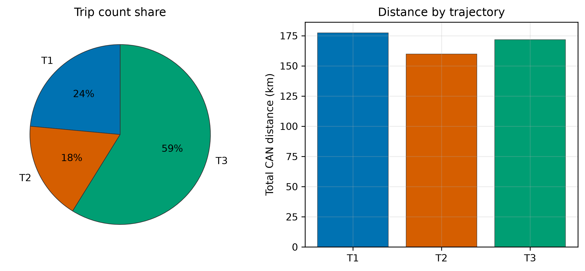

T3 dominates **trip count**, but T1 and T2 contribute a large share of **total distance**.

### 3.2 Duration vs distance

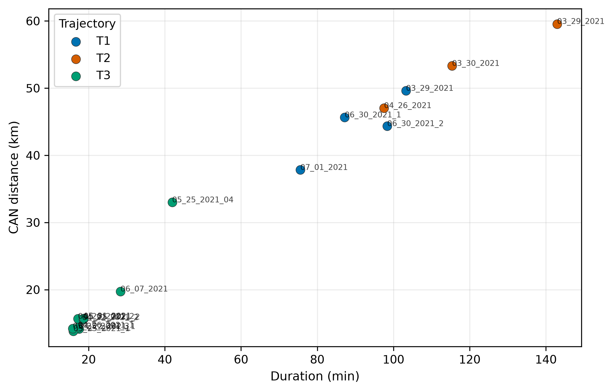

T3 trips cluster as short/fast segments. T1/T2 are longer mixed/urban drives (up to ~143 min / ~60 km).

### 3.3 Per-trip overview

Distances use **CAN-speed integration**. Observed trip energy uses

\[
E_{\mathrm{obs}} = 6.0\,\mathrm{kWh}\times\frac{\mathrm{SOC}_{\mathrm{start}}-\mathrm{SOC}_{\mathrm{end}}}{100}
\]

(the 6.0 kWh usable capacity is the modelling assumption used in this project’s audit, not a measured HELECAR battery test).

| Trip ID | Traj. | Rows | Duration (min) | Dist. CAN (km) | SoC start → end | ΔSoC (pp) | \(E_{\mathrm{obs}}\) (kWh) | Wh/km |
|---|---|---:|---:|---:|---|---:|---:|---:|
| T1_03_29_2021 | T1 | 6189 | 103.3 | 49.61 | 87.54 → 15.00 | 72.54 | 4.352 | 87.7 |
| T1_06_30_2021_1 | T1 | 5200 | 87.2 | 45.64 | 96.06 → 32.42 | 63.64 | 3.818 | 83.7 |
| T1_06_30_2021_2 | T1 | 5903 | 98.4 | 44.35 | 93.42 → 33.06 | 60.36 | 3.622 | 81.7 |
| T1_07_01_2021 | T1 | 4535 | 75.6 | 37.82 | 95.52 → 39.64 | 55.88 | 3.353 | 88.6 |
| T2_03_29_2021 | T2 | 8521 | 143.0 | 59.57 | 97.70 → 18.80 | 78.90 | 4.734 | 79.5 |
| T2_03_30_2021 | T2 | 6868 | 115.4 | 53.32 | 95.14 → 24.50 | 70.64 | 4.238 | 79.5 |
| T2_04_26_2021 | T2 | 5840 | 97.5 | 47.03 | 98.26 → 33.36 | 64.90 | 3.894 | 82.8 |
| T3_04_22_2021_1 | T3 | 1049 | 17.5 | 14.15 | 97.74 → 79.00 | 18.74 | 1.124 | 79.5 |
| T3_04_22_2021_2 | T3 | 1098 | 18.3 | 15.48 | 78.88 → 49.24 | 29.64 | 1.778 | 114.9 |
| T3_04_26_2021_1 | T3 | 1032 | 17.2 | 14.34 | 96.12 → 71.66 | 24.46 | 1.468 | 102.3 |
| T3_04_26_2021_2 | T3 | 1033 | 17.2 | 15.65 | 69.64 → 44.34 | 25.30 | 1.518 | 97.0 |
| T3_05_25_2021_04 | T3 | 2517 | 41.9 | 32.99 | 62.58 → 13.40 | 49.18 | 2.951 | 89.4 |
| T3_05_25_2021_1 | T3 | 961 | 16.0 | 13.83 | 56.20 → 32.40 | 23.80 | 1.428 | 103.2 |
| T3_05_25_2021_2 | T3 | 1121 | 18.7 | 15.56 | 61.74 → 34.18 | 27.56 | 1.654 | 106.3 |
| T3_05_25_2021_3 | T3 | 953 | 15.9 | 14.20 | 62.54 → 38.48 | 24.06 | 1.444 | 101.7 |
| T3_05_31_2021 | T3 | 1122 | 18.7 | 15.70 | 54.60 → 23.36 | 31.24 | 1.874 | 119.4 |
| T3_06_07_2021 | T3 | 1703 | 28.4 | 19.72 | 77.26 → 47.36 | 29.90 | 1.794 | 91.0 |

---

## 4. Aggregate size and energy

| Quantity | Value |
|---|---:|
| Number of trips | 17 |
| Total samples | 55,645 |
| Total duration | 15.50 h (55,779 s) |
| Mean trip duration | 3,282 s ≈ 54.7 min |
| Duration range | 952–8,577 s (15.9–143.0 min) |
| Total CAN distance | 509.0 km |
| Mean CAN distance | 29.94 km |
| Distance range | 13.83–59.57 km |
| Mean GPS-speed distance | 30.03 km |
| Mean haversine distance | 30.80 km |
| Total observed energy | 45.04 kWh |
| Mean observed trip energy | 2.65 kWh |
| Fleet mean intensity | **88.5 Wh/km** |
| Per-trip Wh/km (median / IQR) | 89.4 / 82.8–102.3 |

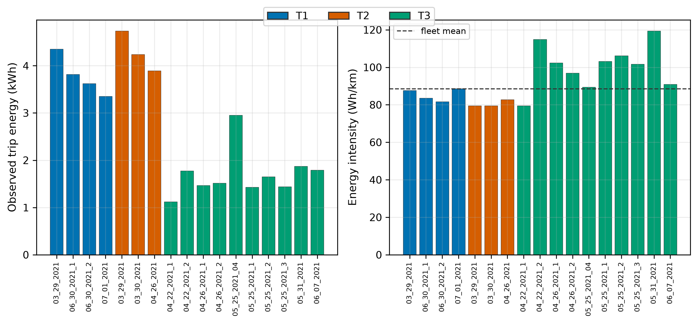

### 4.1 By trajectory

| Traj. | Trips | Dist. (km) | Duration (h) | Energy (kWh) | Mean dist. (km) | Mean energy (kWh) | Mean speed (m/s) | Idle fraction |
|---|---:|---:|---:|---:|---:|---:|---:|---:|
| T1 | 4 | 177.4 | 6.07 | 15.15 | 44.4 | 3.79 | 8.15 | 0.166 |
| T2 | 3 | 159.9 | 5.93 | 12.87 | 53.3 | 4.29 | 7.54 | 0.214 |
| T3 | 10 | 171.6 | 3.49 | 17.03 | 17.2 | 1.70 | 13.85 | 0.045 |

Interpretation:

- **T1/T2** are long, slower, more stop–go urban / mixed trips with higher idle time.
- **T3** trips are shorter and faster (ring-like), with much lower idle fraction and higher mean speed.
- Energy intensity (Wh/km) is generally higher on shorter T3 segments than on the long T2 urbans.

---

## 5. SoC analysis (central to weak supervision)

### 5.1 Start / end / depletion

| Statistic | SoC start (%) | SoC end (%) | Depletion (pp) |
|---|---:|---:|---:|
| Mean | 81.23 | 37.07 | 44.16 |
| Across trips | 54.6–98.3 | 13.4–79.0 | 18.7–78.9 |

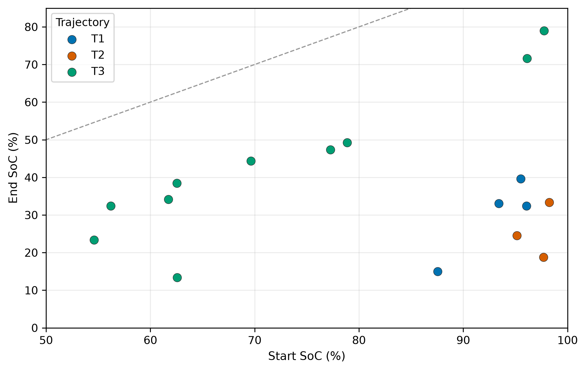

Trips typically start high and finish mid/low. There is no consistent full 0–100% cycle.

Example SoC time series (one trip per trajectory):

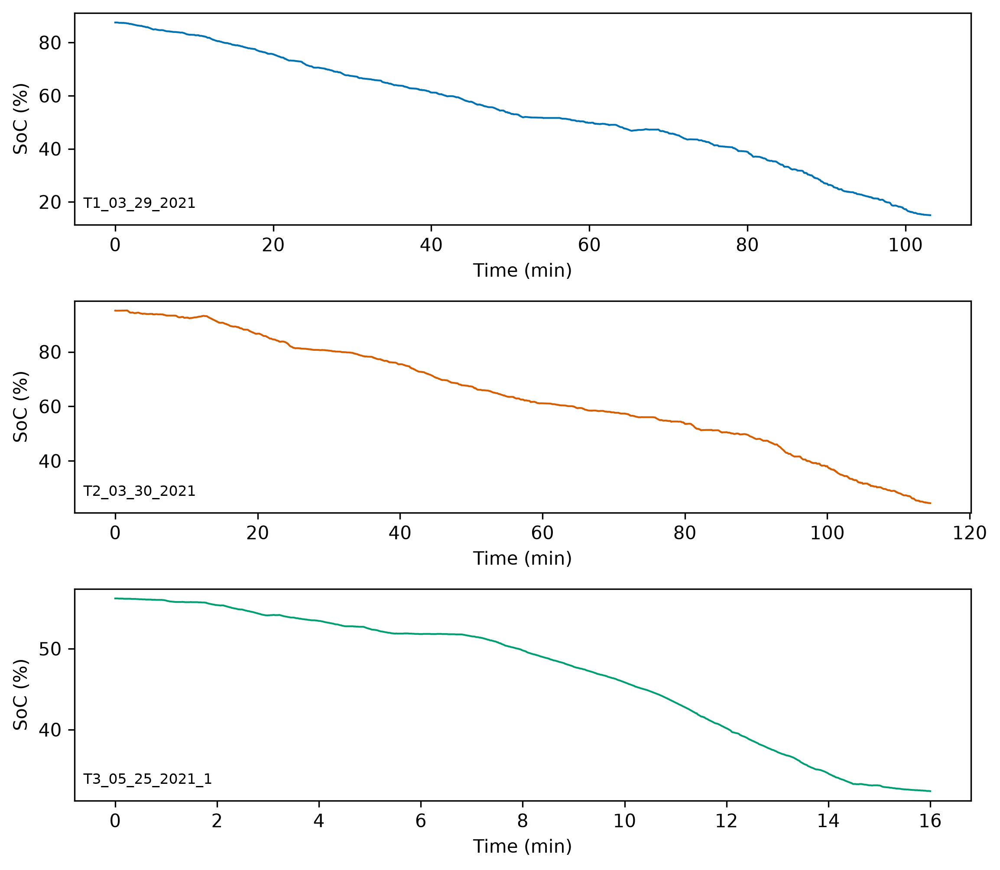

The step-like appearance of SoC is consistent with quantized BMS reporting.

### 5.2 Empirical quantization

Successive non-zero SoC transitions are strongly concentrated on multiples of **0.02 percentage points**, not a coarse 1% BMS step.

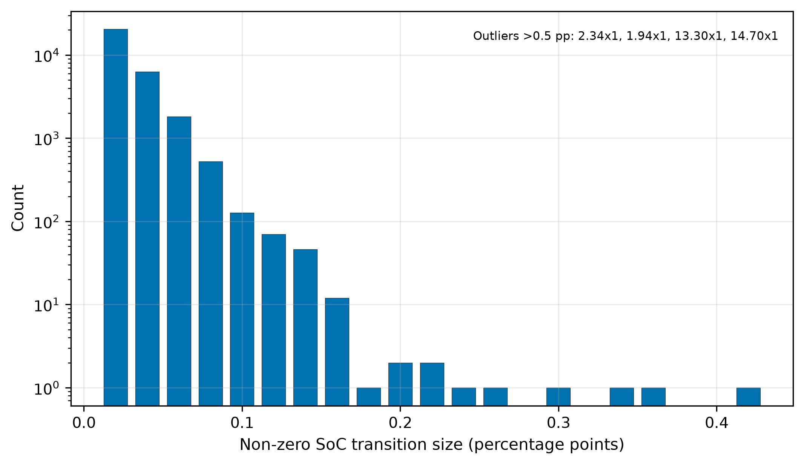

| Transition size (pp) | Count |
|---:|---:|
| 0.02 | 20,515 |
| 0.04 | 6,305 |
| 0.06 | 1,820 |
| 0.08 | 523 |
| 0.10 | 127 |
| larger / rare | few |

Global audit estimate:

- empirical \(q = 0.02\) pp
- trip-level mode / median of \(q\) also 0.02 pp
- one T3 trip (`T3_04_22_2021_2`) has trip-mode \(q=0.04\), but the pooled estimate remains 0.02

At usable capacity 6 kWh, a **single 0.02 pp SoC step** corresponds to only

\[
6.0 \times 0.02 / 100 = 0.0012\,\mathrm{kWh} = 1.2\,\mathrm{Wh}.
\]

Treating one-step SoC differences as instantaneous power labels would therefore put supervision on the scale of quantization noise. That is why multi-window integrated energy is used in the modelling work.

### 5.3 SoC increases (non-monotonicity)

SoC is not always monotonically decreasing:

| Quantity | Value |
|---|---:|
| Total SoC-increase events | 2,477 |
| Typical max increase per trip | 0.02–0.04 pp |
| Notable anomaly | `T3_05_25_2021_04`: max increase **13.3 pp** (also appears in transition outliers 13.3 / 14.7 pp) |

Most increases are tiny and consistent with quantization/noise or regen-related BMS reporting. The large jump on `T3_05_25_2021_04` is a clear data-quality caveat for that trip.

### 5.4 Unique SoC levels

Trips show hundreds to thousands of distinct SoC values (e.g. ~1,900–2,800 unique levels on long T1/T2 trips), which matches a fine ~0.02 pp grid rather than coarse integer SoC.

### 5.5 Occasional GPS outliers

Most trips have fully valid LAT/LON in the Morocco bounding box. Two analysed files contain a few bad GPS samples:

- `T1_06_30_2021_2`: 4 samples with latitude 0
- `T3_06_07_2021`: 3 samples with an absurd longitude (~1555)

These do not affect CAN-speed distance, but they matter for any map-based visualization.

---

## 6. Time sampling quality

| Quantity | Value |
|---|---|
| Median \(\Delta t\) | 1.0 s on all trips |
| Sampling | essentially 1 Hz |
| Gaps \(> 2\) s (total) | 9 |
| Trips with gaps | T1_03_29, T1_06_30_1, T2_03_29, T2_03_30, T2_04_26 |
| Max gap | 31 s (`T2_03_30_2021`) |
| Duplicate timestamps | present on some long T1/T2 trips (up to 57 on `T2_03_29_2021`) |
| Most T3 trips | perfect 1 s spacing, no gaps, no duplicates |

Overall: chronologically clean enough for discrete-time integration, with a small number of gaps on longer urban trips.

---

## 7. Missing values

The audited analysed tables show **zero missing values** in every original and canonical column for all 17 trips (Date/Time/Soc/Speed/Mode/LAT/LON/ALT/GpsSpeed/Temperature/Humidity/Weather/WindSpeedAv/Traffic/SpeedLimit and their canonical aliases).

---

## 8. Speed: CAN vs GPS

CAN speed is the primary kinematic signal for distance and physics. GPS speed is available for agreement checks.

| Statistic (across trips) | Value |
|---|---:|
| Mean \|CAN − GPS\| MAE | 7.28 km/h |
| Mean correlation | 0.84 |
| Best agreement | T3 trips (corr often > 0.90) |
| Weaker agreement | long T1/T2 urbans (corr ~0.68–0.79) |

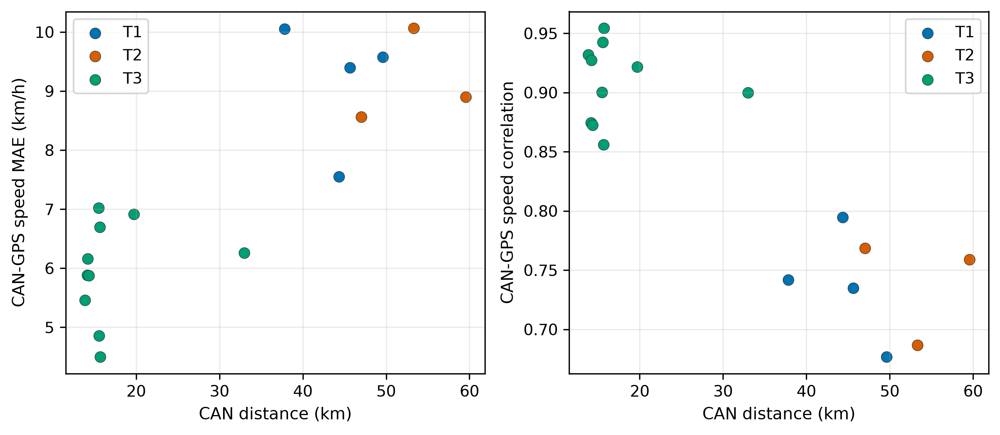

CAN–GPS disagreement is expected in dense urban GNSS conditions. Using CAN speed for distance is therefore preferable for longitudinal energy modelling.

---

## 9. Altitude / grade quality

Raw altitude is noisy:

- altitude ranges include physically suspicious lows (e.g. −111 m on some trips)
- large successive altitude jumps occur (max absolute step up to 245 m)
- many trips have dozens of \(|\Delta h|>5\) m steps

Because of this, grade used in physics is derived from **smoothed altitude over a spatial window**, not from raw successive GPS height differences. The audit reports **674 grade-clip samples** after processing.

Mean cumulative elevation (from filtered grade × distance):

| Traj. | Mean gain (m) |
|---|---:|
| T1 | 443 |
| T2 | 658 |
| T3 | 177 |

Urban/mixed T1–T2 accumulate more elevation change than the shorter T3 ring segments.

---

## 10. Driving and environment distributions

From preprocessed trip summaries:

| Feature | Mean (trip-level) | Min | Max |
|---|---:|---:|---:|
| Mean speed | 11.39 m/s (~41 km/h) | 6.91 | 15.15 |
| Idle fraction | 0.104 | 0.024 | 0.269 |
| Mean temperature | 21.6 °C | 17.4 | 27.0 |
| Mean humidity | 62.7% | 40.4 | 79.2 |
| Mean wind speed | 3.29 m/s | 0.18 | 7.49 |

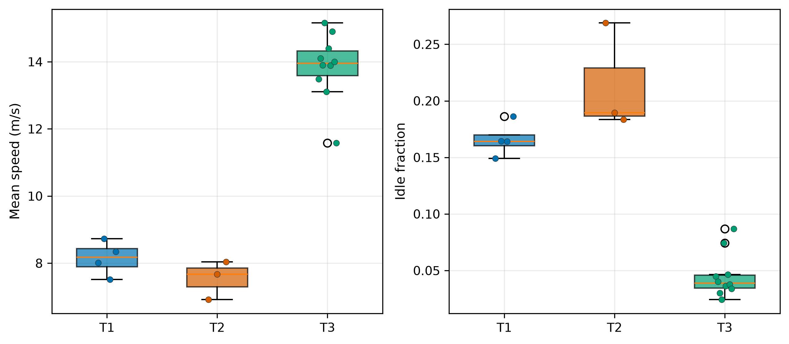

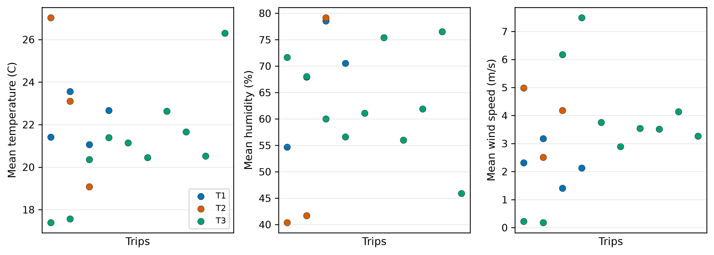

Traffic:

- T3 trips are almost entirely traffic level 0 (free-flow / low).
- T1/T2 show substantial fractions of levels 1–2.

Wind speed is recorded **without direction**, so it is only a covariate, not a signed headwind for aerodynamics.

---

## 11. Weak-supervision window inventory

Training-style overlapping multi-window energy constraints derived from SoC:

| Window type | Count |
|---|---:|
| SoC-event 0.1 pp | 18,192 |
| SoC-event 0.2 pp | 18,188 |
| SoC-event 0.5 pp | 18,142 |
| Fixed 60 s | 1,730 |
| Fixed 120 s | 895 |
| Fixed 300 s | 346 |
| Fixed 600 s | 161 |
| Full trip | 17 |
| **Total** | **57,671** |

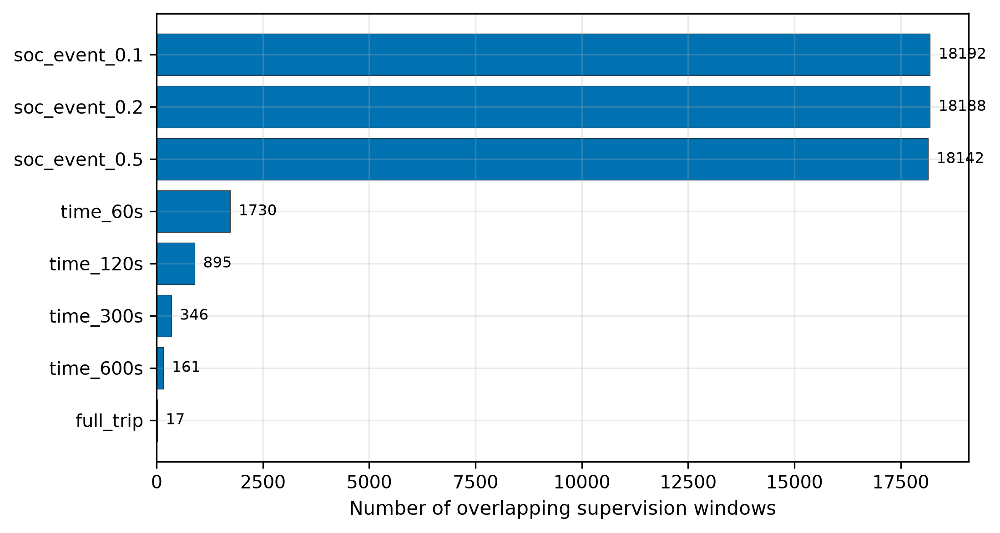

Longer T1/T2 trips dominate the window counts (e.g. `T2_03_29_2021` alone contributes >2,000 SoC-event windows per threshold). Short T3 trips contribute fewer windows but still have non-trivial SoC-event coverage.

---

## 12. Physics-only energy vs SoC energy (diagnostic only)

Comparing the analytical longitudinal model’s integrated battery energy with SoC-derived \(E_{\mathrm{obs}}\):

| Quantity | Value |
|---|---:|
| Mean physics residual \(E_{\mathrm{physics}}-E_{\mathrm{obs}}\) | **−0.780 kWh** |
| Mean absolute residual | 0.780 kWh |

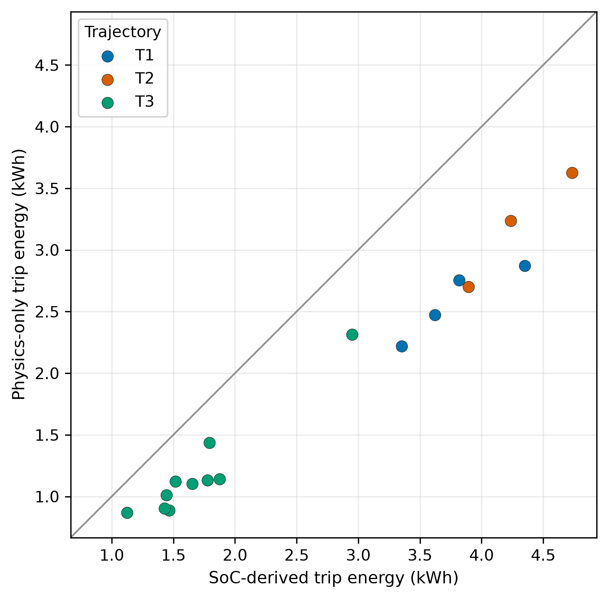

Every point lies below the \(y=x\) line: the analytical model **systematically under-predicts** trip energy. Peak instantaneous physics battery power in this diagnostic reaches about **34 kW** on `T2_03_29_2021` (unbounded wheel×speed spikes), which is a plausibility caveat for instantaneous power, not for the existence of a useful trip-energy prior.

This gap between physics and SoC energy is part of the motivation for a residual neural correction under weak SoC supervision.

---

## 13. Implications for modelling (dataset view only)

1. **No power labels.** Latent battery power must be inferred; SoC provides only integrated energy.
2. **Fine but noisy SoC.** Empirical step ≈ 0.02 pp ⇒ one-step labels are ~1.2 Wh and unsuitable as instantaneous power targets.
3. **Small trip set.** 17 complete trips; statistical unit should be the trip, not 1 Hz rows.
4. **Trajectory imbalance.** T3 dominates trip count; T1/T2 dominate duration and distance.
5. **Heterogeneous driving.** Urban stop–go (T1/T2) vs faster ring segments (T3).
6. **Generally clean tables.** No missing analysed fields; mostly 1 Hz; limited timestamp gaps.
7. **Altitude noise.** Grade must be filtered; raw ALT is not plug-and-play.
8. **One notable SoC anomaly.** `T3_05_25_2021_04` has a large SoC jump and should be treated carefully in qualitative discussion.
9. **Occasional GPS outliers.** A few bad LAT/LON samples exist in two trips; CAN distance remains the preferred distance measure.
10. **Physics prior is informative but biased.** Useful structure, systematic underestimation of energy.

---

## 14. Figure index

| File | Content |
|---|---|
| `figures/fig01_distance_vs_duration.png` | Trip duration vs CAN distance |
| `figures/fig02_soc_start_end.png` | Start vs end SoC |
| `figures/fig03_energy_and_intensity.png` | Trip energy and Wh/km |
| `figures/fig04_soc_transitions.png` | SoC transition-size histogram |
| `figures/fig05_speed_idle_by_trajectory.png` | Mean speed and idle by trajectory |
| `figures/fig06_environment.png` | Temperature, humidity, wind |
| `figures/fig07_can_vs_gps_speed.png` | CAN–GPS speed agreement |
| `figures/fig08_supervision_windows.png` | Multi-window counts |
| `figures/fig09_physics_vs_soc_energy.png` | Physics vs SoC energy |
| `figures/fig10_example_gps_tracks.png` | Example GPS tracks (T1/T2/T3) |
| `figures/fig11_example_soc_traces.png` | Example SoC time series |
| `figures/fig12_trajectory_composition.png` | Trip-count and distance shares |

---

## 15. File map for this analysis

| Audit artifact | Content |
|---|---|
| `outputs/data_audit/paper_dataset_summary.csv` | global paper-facing summary |
| `outputs/data_audit/trip_characteristics.csv` | per-trip distance / SoC / energy |
| `outputs/data_audit/trip_characteristics_preprocessed.csv` | speed, idle, weather, elevation, traffic |
| `outputs/data_audit/trip_summary.csv` | file paths, columns, SoC extrema |
| `outputs/data_audit/soc_quantization.csv` | per-trip \(q\) estimates |
| `outputs/data_audit/soc_quantization_global.json` | pooled transition histogram |
| `outputs/data_audit/soc_increases.csv` | SoC increase events |
| `outputs/data_audit/timestamp_issues.csv` | gaps / duplicates / \(\Delta t\) |
| `outputs/data_audit/missing_values.csv` | missingness (all zero here) |
| `outputs/data_audit/speed_gps_agreement.csv` | CAN vs GPS speed |
| `outputs/data_audit/altitude_quality.csv` | raw altitude diagnostics |
| `outputs/data_audit/windows_by_scale.csv` | multi-window counts |
| `outputs/data_audit/windows_per_trip.csv` | windows per trip |
| `outputs/data_audit/physics_only_vs_soc_energy_diagnostic.csv` | physics vs SoC energy |
| `outputs/data_audit/directory_structure.txt` | discovered local files |

---

## 16. Citation

NaitMalek, Y., Najib, M., Bakhouya, M., Gaber, J., 2023. HELECAR-D: A dataset for urban electro mobility in Moroccan context. *Data in Brief* 48, 109080. https://doi.org/10.1016/j.dib.2023.109080

Data release: https://doi.org/10.5281/zenodo.7217707 (CC-BY-4.0).
